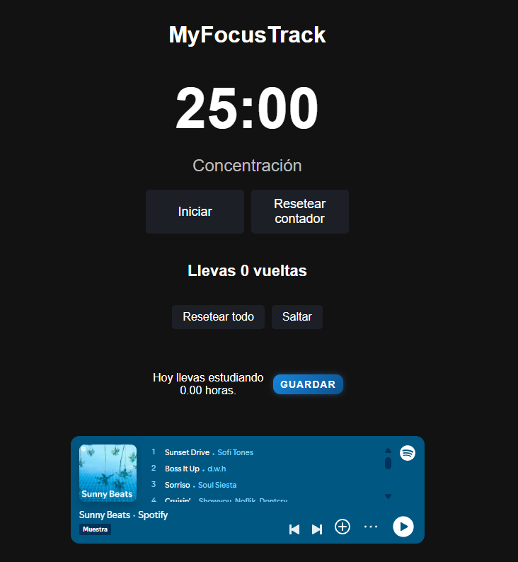
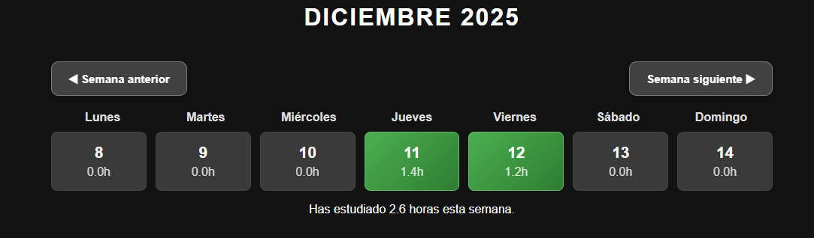
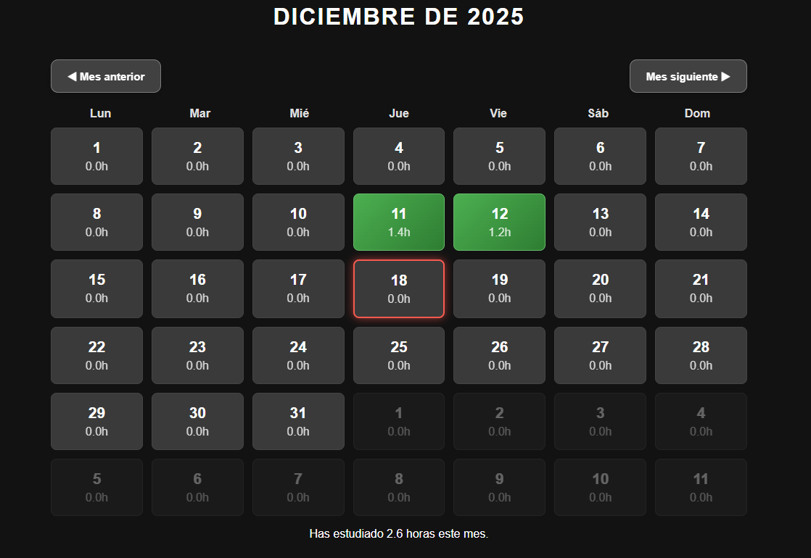
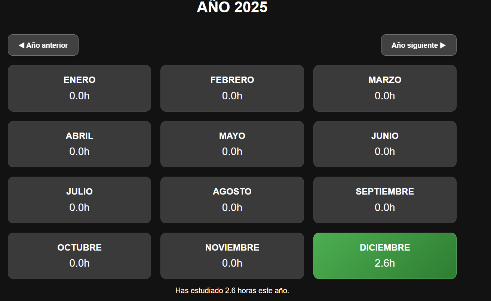
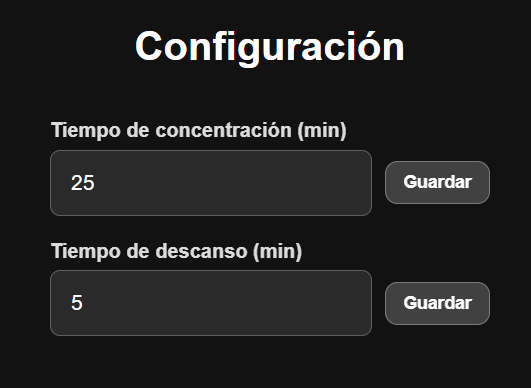

# MyFocusTrack

MyFocusTrack es una aplicación de productividad basada en la técnica Pomodoro, pensada para ayudarte a organizar tus sesiones de estudio y llevar un registro del tiempo que dedicás cada día.

## Comienza a usarla
https://myfocustrack.vercel.app/src/pages/pomodoro/pomodoro.html

## ¿Qué podés hacer con MyFocusTrack?
La aplicación te permite gestionar tus sesiones de estudio de forma simple y visualizar el tiempo que vas acumulando:

- Registro diario de tiempo de estudio
- Estadísticas semanales, mensuales y anuales
- Seguimiento de tus sesiones Pomodoro
- Tiempos de concentración y descanso configurables

## Tenologías
- SpringBoot
- HTML
- Css
- TypeScript
- MySQL

##  Capturas

  

  
  
  

  

